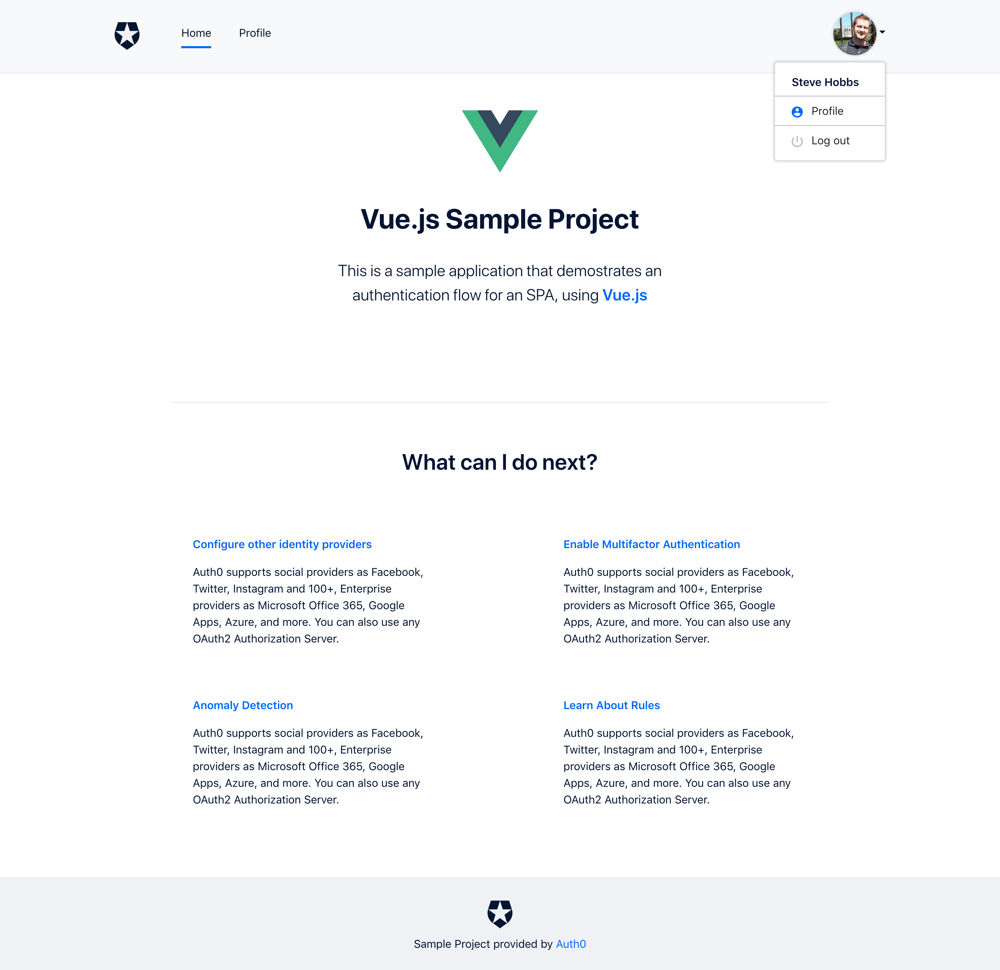

# Implementing the Design

This document is designed to serve as a guide for implementing the custom quickstarts design. While the design itself simply extends [Bootstrap 4](https://getbootstrap.com/docs/4.0/getting-started/introduction/), some additional classes and minor styles are required inside the application in order to achieve the desired look and feel, which cannot be easily assimilated into this theme library.

The ultimate goal would be to push as much of the design implementation as possible into this library. As such, as suggestions for doing so would be welcome.



## Prerequisites

This guide assumes that the project uses some kind of build tool or CLI, such as [Webpack](https://webpack.js.org/) or [`create-react-app`](https://reactjs.org/docs/create-a-new-react-app.html#create-react-app) (which uses Webpack).

## Using the Theme Assets

To integrate the theme assets into a project, first import the CSS and JavaScript into the main entry point of the application:

```js
import "jquery";
import "samples-bootstrap-theme";
import "samples-bootstrap-theme/dist/css/auth0-theme.css";
```

### Installing and configuring icons

The theme makes use of certain icons, such as the link icon that appears on the home page. This guide will demonstrate how to add these icons using [Font Awesome](https://fontawesome.com/), although the same icons could be found on different icon packs.

Start by installing the Font Awesome core library and the icons:

```bash
npm install --save-dev @fortawesome/fontawesome-svg-core @fortawesome/free-solid-svg-icons
```

> **Note**: The `@fortawesome` package name is not a typo

Then, import the libaries into your application entrypoint:

```js
import { library } from "@fortawesome/fontawesome-svg-core";
import { faUser, faLink } from "@fortawesome/free-solid-svg-icons";
```

Using the icons depends on the technology stack you are using. Here are examples for Vue.js, React and Angular:

### Vue

```bash
npm install --save-dev @fortawesome/vue-fontawesome
```

Add the following to your application entrypoint:

```js

import { FontAwesomeIcon } from "@fortawesome/vue-fontawesome";

library.add(faUser, faLink);

Vue.component("font-awesome-icon", FontAwesomeIcon);
```

To use the icon inside a template:

```html
<font-awesome-icon icon="link"/>
```

### React

[instructions to follow]

### Angular

[instructions to follow]

## Installing and Using HighlightJS

[HighlightJS](https://highlightjs.org/) is used on some pages to show code/JSON snippets. HighlightJS must be bound to specific elements on the page. Example implementations for Vue, React, and Angular are below:

### Vue

The Vue implementation works by creating a [custom directive](https://vuejs.org/v2/guide/custom-directive.html), which is used to apply HighlightJS to the element that the directive is applied to.

First, install the library:

```bash
npm install --save-dev highlight.js
```

Create a new file in `src/directives/highlight.js` with the following content:

```js
import hljs from "highlight.js/lib/highlight";
import json from "highlight.js/lib/languages/json";
import "highlight.js/styles/monokai-sublime.css";

hljs.registerLanguage("json", json);

export default {
  deep: true,
  bind: function(el, binding) {
    // on first bind, highlight all targets
    let targets = el.querySelectorAll("code");
    targets.forEach(target => {
      // if a value is directly assigned to the directive, use this
      // instead of the element content.
      if (binding.value) {
        target.textContent = binding.value;
      }
      hljs.highlightBlock(target);
    });
  },
  componentUpdated: function(el, binding) {
    // after an update, re-fill the content and then highlight
    let targets = el.querySelectorAll("code");
    targets.forEach(target => {
      if (binding.value) {
        target.textContent = binding.value;
        hljs.highlightBlock(target);
      }
    });
  }
};
```

> **Note**: This sample only imports the JSON language. For other languages, modify the import to bring in the languages you want, and make sure they are registered using `hljs.registerLanguage`

Register the directive at the entrypoint of your Vue app:

```js
import HighlightJs from "./directives/highlight";

// ...

Vue.directive("highlightjs", HighlightJs);
```

Find an element that you want to apply HighlightJS to:

```html
<pre v-highlightjs class="rounded">
  <code class="json">
  {
    "some json code": true
  }
  </code>
</pre>
```